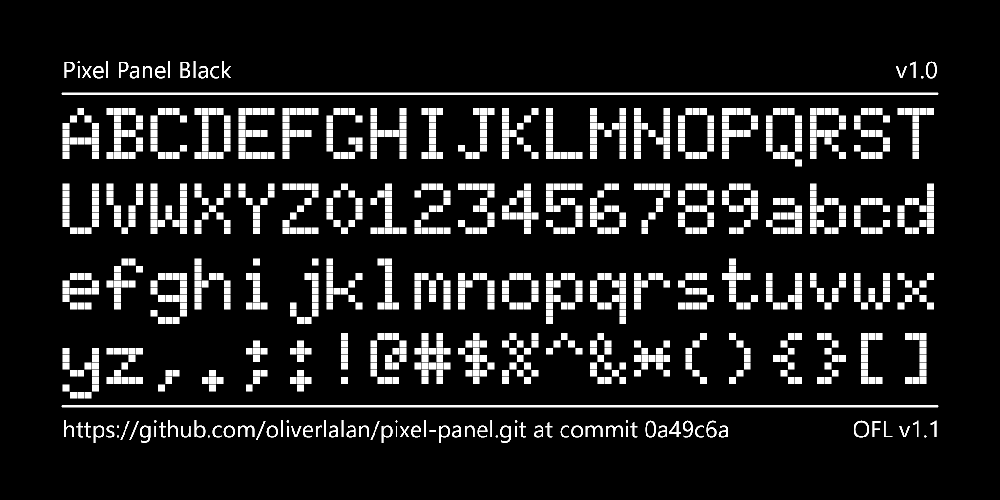

## About

The Pixel Panel font is a 6x10 bitmap-inspired font featuring two variable axes: One that controls the pixel size, and another one that controls the pixel roundness.

Born from the struggle of finding the perfect font during the modeling of real-world items, the Pixel Panel font emerged as a solution that marries classic appeal with adaptability, making it the go-to choice for a variety of applications.

## Samples

## Glyphsets

List of currently supported Google Fonts glyphsets:
- GF_Latin_Kernel
- GF_Latin_Core

## QA status

[Google Fonts QA current status](<documentation/reports/2024-01-13 QA.md>)

## Roadmap

 - [ ] Color support
 - [ ] Non-active pixels (binary axis)
 - [ ] More languages
