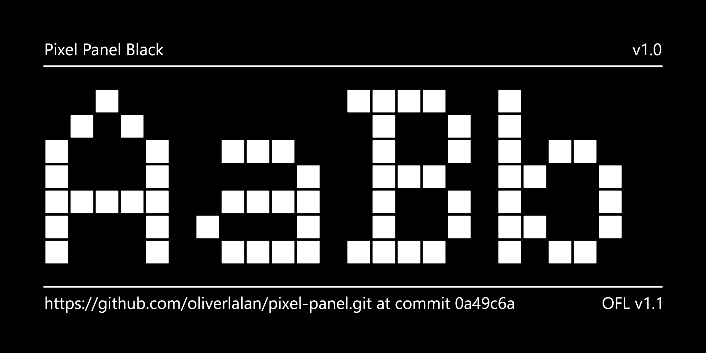

The Pixel Panel font, a two axes variable font. One for the pixels' size. One for the pixels' roundness.

## Samples

## Axes

TODO Add gifs

### Weight

### Roundness

## Supported glyphsets

- GF_Latin_Kernel
- GF_Latin_Core

## QA status

[Google Fonts QA current status](<documentation/reports/2024-01-13 QA.md>)
